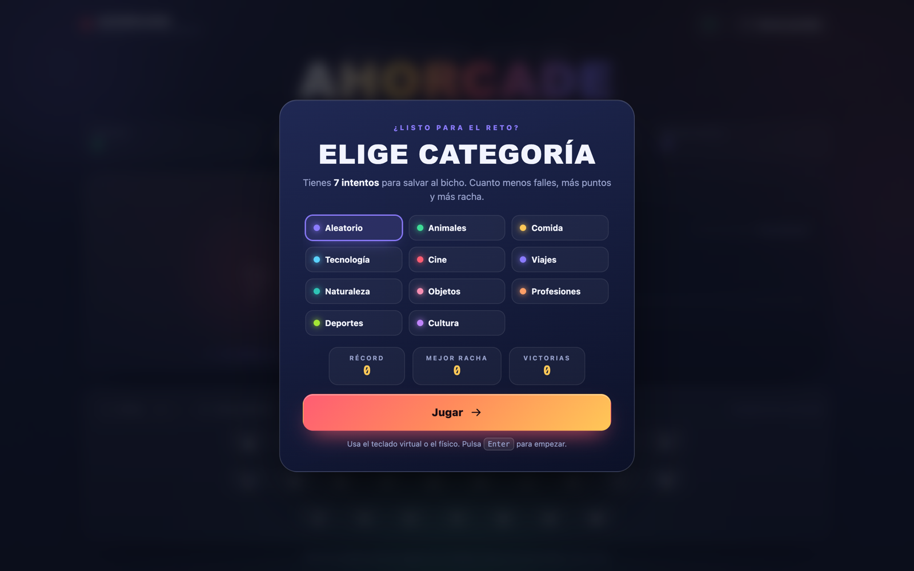

<div align="center">

# AHORCADE

**Arcade de palabras: salva al bicho antes de que la cuerda diga basta.**

[](https://rldona.github.io/ahorcade/)
[](https://github.com/rldona/ahorcade/actions/workflows/ci.yml)
[](LICENSE)
[](https://github.com/rldona/ahorcade/commits/main)
[](https://github.com/rldona/ahorcade)
[](https://github.com/rldona/ahorcade)

[](https://github.com/rldona/ahorcade/stargazers)
[](https://github.com/rldona/ahorcade/network/members)
[](https://github.com/rldona/ahorcade/issues)
[](#contribuir)


</div>



## Índice

- [Demo](#demo)
- [Características](#características)
- [Cómo jugar](#cómo-jugar)
- [Controles](#controles)
- [Puntuación](#puntuación)
- [Categorías](#categorías)
- [Tecnologías](#tecnologías)
- [Estructura del proyecto](#estructura-del-proyecto)
- [Ejecutar en local](#ejecutar-en-local)
- [Despliegue en GitHub Pages](#despliegue-en-github-pages)
- [Accesibilidad](#accesibilidad)
- [Contribuir](#contribuir)
- [Licencia](#licencia)

## Demo

Juega directamente desde el navegador, sin instalar nada:

**https://rldona.github.io/ahorcade/**

## Características

- **7 fallos y a la horca**: adivina la palabra oculta antes de agotar los intentos.
- **Puntuación con bonus**: puntos por resolver, precisión, racha y partida perfecta.
- **Pistas de pago**: revela una letra por 75 puntos (anula los bonus de la ronda).
- **10 modos de juego**: Aleatorio + 9 categorías temáticas con más de 200 palabras.
- **Racha y récords**: mejor puntuación, mejor racha y victorias guardadas en `localStorage`.
- **Teclado físico y virtual**: incluye la letra `Ñ` y normaliza los acentos.
- **Personaje animado**: un bicho SVG que cambia de cara según lo que falles y baila al ganar.
- **Efectos y sonido**: confeti, viñeta de victoria/derrota, aviso de racha y audio sintetizado con la Web Audio API, sin archivos externos.
- **Responsive y offline**: funciona en móvil y escritorio, y no necesita conexión tras la primera carga.
- **Cero dependencias**: HTML, CSS y JavaScript vanilla.

## Cómo jugar

1. Elige una categoría (o deja **Aleatorio**) y pulsa **Jugar**.
2. Pulsa las letras para descubrir la palabra. Cada letra que no esté te suma un fallo.
3. Acierta todas las letras antes de cometer **7 fallos** para salvar al bicho.
4. Si te atascas, usa una **Pista** (cuesta 75 puntos) u **Otra palabra** para cambiar de reto.

## Controles

| Acción | Cómo |
| --- | --- |
| Adivinar una letra | Teclado virtual en pantalla o tecla física `A`–`Z` / `Ñ` |
| Empezar / confirmar | `Enter` |
| Nueva partida | Botón **Nueva partida** en la barra superior |
| Silenciar / activar sonido | Botón con el icono de altavoz |
| Pista | Botón **Pista** (requiere al menos 75 puntos) |
| Cambiar de palabra | Botón **Otra palabra** |

Los acentos se ignoran al jugar: `Á` cuenta como `A` y `Ñ` como `Ñ`.

## Puntuación

| Concepto | Puntos |
| --- | --- |
| Palabra resuelta | `+100` |
| Bonus de precisión | `+20` por cada intento restante (`fallos restantes × 20`) |
| Bonus de racha | `+25` por victoria consecutiva, hasta un máximo de 10 |
| Ronda perfecta (sin fallos) | `+150` |
| Pista | `-75` (y anula el resto de bonus de la ronda) |

La racha solo aumenta al ganar **sin usar pistas**. Los récords se guardan siempre, incluso en modo privado del navegador (con degradación segura si `localStorage` no está disponible).

## Categorías

`Animales` · `Comida` · `Tecnología` · `Cine` · `Viajes` · `Naturaleza` · `Objetos` · `Profesiones` · `Deportes` · `Cultura` · y **Aleatorio**, que mezcla todas.

## Tecnologías

- **HTML5** semántico e inline SVG.
- **CSS3**: custom properties, Grid, Flexbox, `backdrop-filter` y animaciones con `@keyframes`.
- **JavaScript (ES6+)** vanilla, sin frameworks ni build step.
- **Web Audio API** para los sonidos, generados por osciladores (sin ficheros de audio).
- **localStorage** para récords, sonido y categoría preferida.

## Estructura del proyecto

```
ahorcade/
├── index.html                 # Estructura, SVG del personaje y diálogos
├── styles.css                 # Tema neón, layout responsive y animaciones
├── script.js                  # Motor del juego, sonido y estado
├── assets/
│   └── cover.png              # Captura usada en este README
├── .github/
│   └── workflows/
│       └── ci.yml             # Validación de HTML y JavaScript
├── .nojekyll                  # Evita el procesado Jekyll en GitHub Pages
├── LICENSE                    # MIT
└── README.md
```

## Ejecutar en local

Al ser 100% estático puedes abrir `index.html` directamente, aunque se recomienda un servidor local para que `localStorage` y el audio funcionen sin restricciones de `file://`:

```bash
# Opción 1: servidor integrado de Python
python3 -m http.server 8000
# → http://localhost:8000

# Opción 2: con Node
npx serve .
```

## Despliegue en GitHub Pages

El sitio se publica directamente desde la rama `main` (raíz del repositorio) en **Settings → Pages**. Al no existir build ni dependencias, cualquier push a `main` actualiza el juego automáticamente.

## Accesibilidad

- Navegación completa por teclado y foco visible.
- Diálogos nativos (`<dialog>`) y etiquetas ARIA para la palabra, las vidas y los mensajes de estado.
- Respeta `prefers-reduced-motion` (reduce las animaciones) y `prefers-contrast: more` (mejora el contraste).
- Contraste cuidado y tamaños de texto fluidos adaptados a pantallas pequeñas.

## Contribuir

Las ideas y mejoras son bienvenidas. Abre un _issue_ para reportar un problema o proponer una categoría nueva, y envía un _pull request_ para cambios concretos.

## Licencia

Distribuido bajo la licencia **MIT**. Consulta [LICENSE](LICENSE) para más detalles.

<div align="center">

Hecho con cariño para jugar unas partidas rápidas.

</div>
